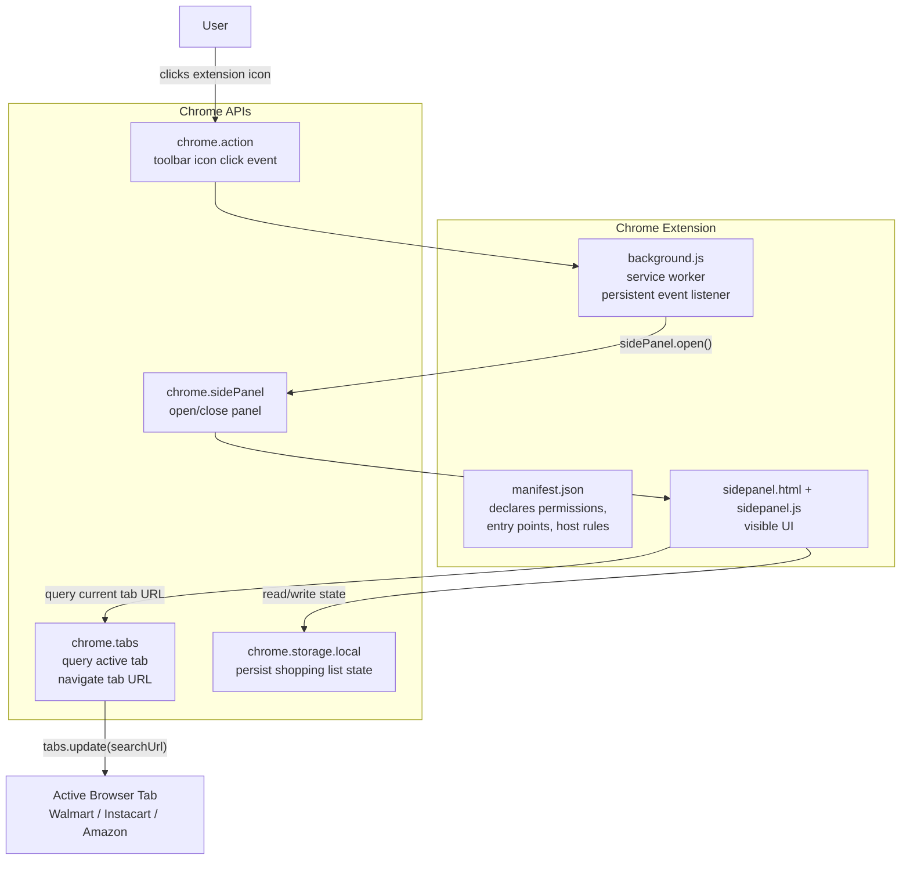
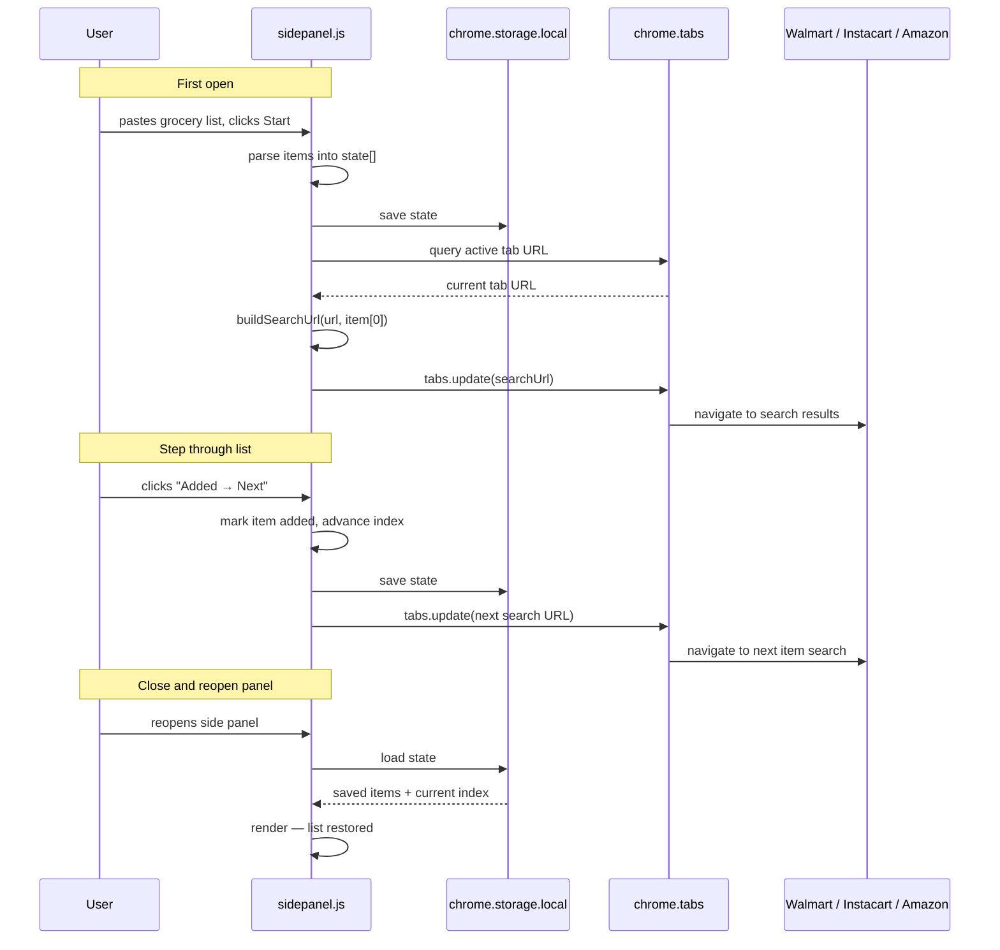
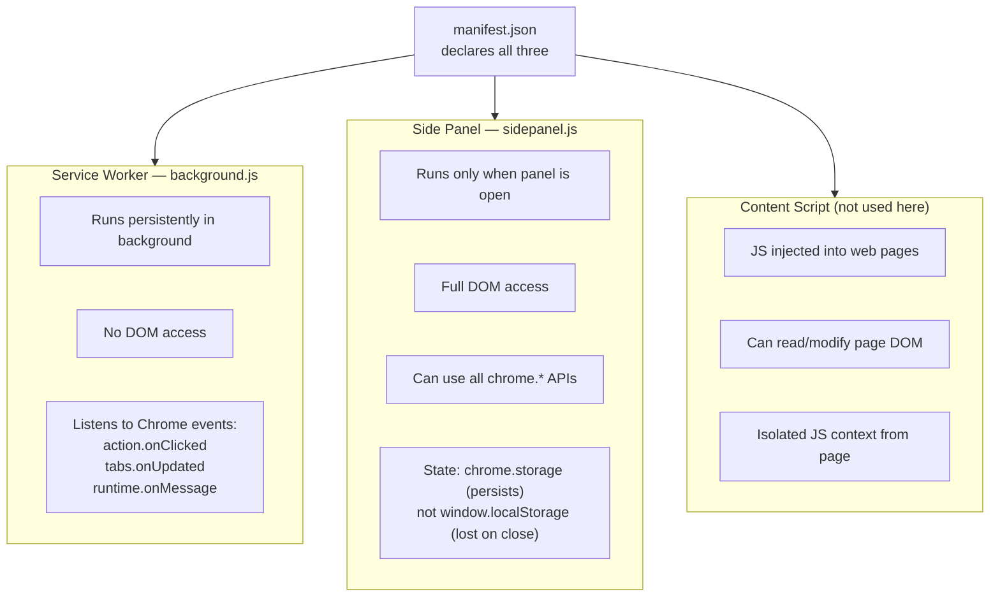

# Chrome Extension Architecture — Shopping Assistant

## Key Files

| File | Purpose |
|---|---|
| [`manifest.json`](~/code/recipe-management/shopping-assistant/manifest.json:1) | Extension declaration — permissions, entry points |
| [`manifest.json:6`](~/code/recipe-management/shopping-assistant/manifest.json:6) | `permissions` block |
| [`manifest.json:11`](~/code/recipe-management/shopping-assistant/manifest.json:11) | `host_permissions` — Walmart, Instacart, Amazon |
| [`background.js`](~/code/recipe-management/shopping-assistant/background.js:1) | Service worker — opens side panel on icon click |
| [`sidepanel.js:1`](~/code/recipe-management/shopping-assistant/sidepanel.js:1) | State object |
| [`sidepanel.js:9`](~/code/recipe-management/shopping-assistant/sidepanel.js:9) | `save()` — `chrome.storage.local.set` |
| [`sidepanel.js:13`](~/code/recipe-management/shopping-assistant/sidepanel.js:13) | `load()` — `chrome.storage.local.get` |
| [`sidepanel.js:25`](~/code/recipe-management/shopping-assistant/sidepanel.js:25) | `buildSearchUrl()` — detects Walmart / Instacart / Amazon |
| [`sidepanel.js:78`](~/code/recipe-management/shopping-assistant/sidepanel.js:78) | `chrome.tabs.query` — reads current tab URL |
| [`sidepanel.js:86`](~/code/recipe-management/shopping-assistant/sidepanel.js:86) | `chrome.tabs.update` — navigates to search URL |

---

## Component Overview

---

## Shopping Flow (Sequence)

---

## Extension Contexts Compared

