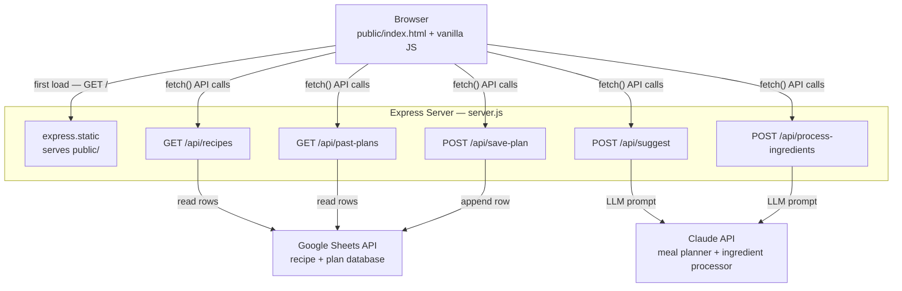
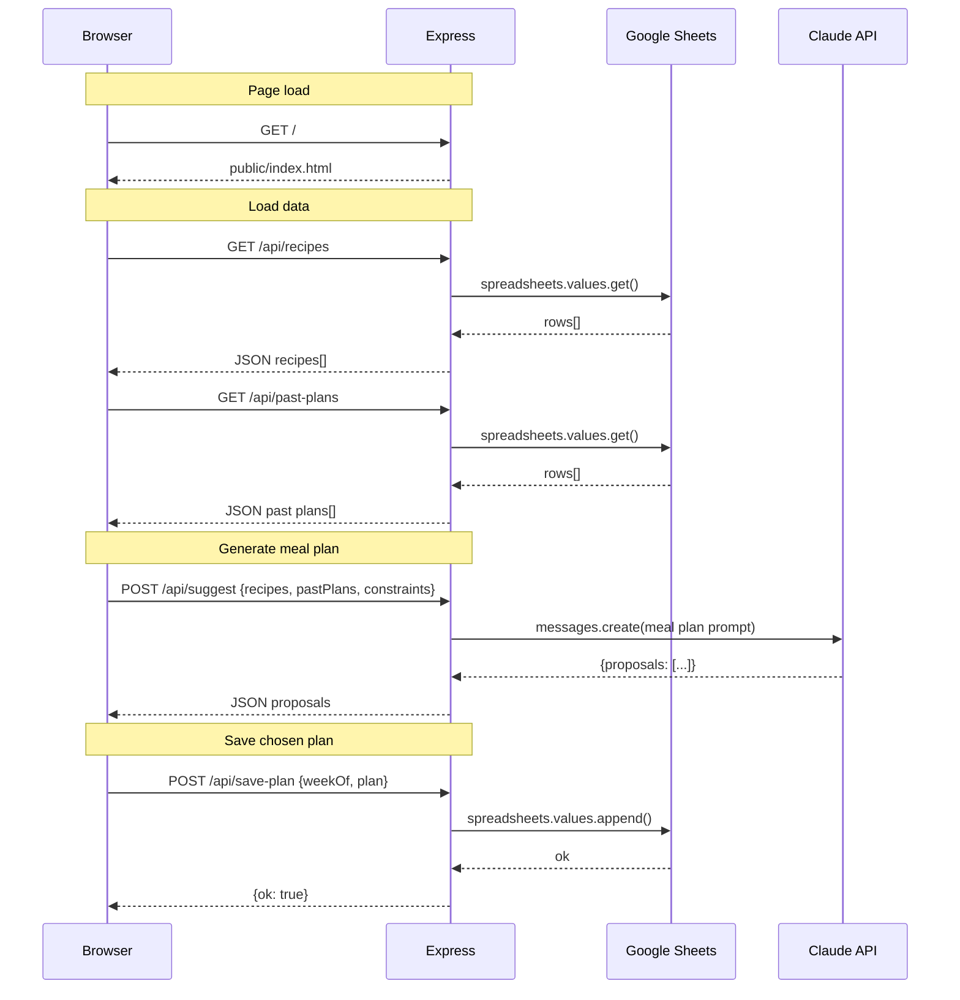
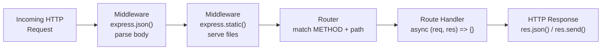

# Express App Architecture — Recipe Planner

## Key Files

| File | Purpose |
|---|---|
| [`server.js`](~/code/recipe-management/planner/server.js:1) | Entry point — all routes and middleware |
| [`server.js:10`](~/code/recipe-management/planner/server.js:10) | Middleware: `express.json()` + `express.static()` |
| [`server.js:24`](~/code/recipe-management/planner/server.js:24) | `GET /api/recipes` |
| [`server.js:42`](~/code/recipe-management/planner/server.js:42) | `GET /api/past-plans` |
| [`server.js:58`](~/code/recipe-management/planner/server.js:58) | `POST /api/suggest` — Claude meal plan prompt |
| [`server.js:112`](~/code/recipe-management/planner/server.js:112) | `POST /api/save-plan` |
| [`server.js:132`](~/code/recipe-management/planner/server.js:132) | `POST /api/process-ingredients` — Claude ingredient processor |
| [`public/index.html`](~/code/recipe-management/planner/public/index.html:1) | Frontend UI (vanilla JS, no React) |

---

## Component Overview

---

## Request / Response Flow

---

## General Express Request Lifecycle

